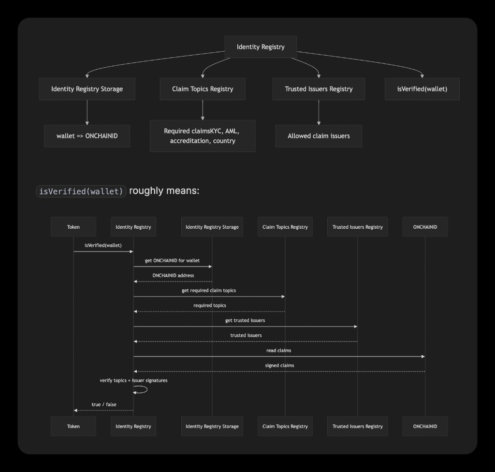
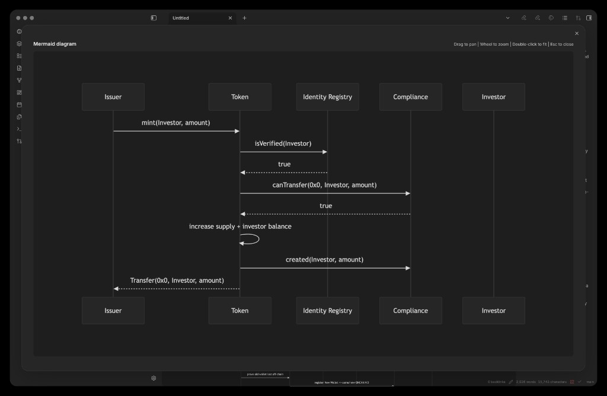

# Slick Mermaid

Minimal, monotone Mermaid plugin for Obsidian — designed for the [baseline](https://github.com/aaaaalexis/obsidian-baseline) theme.

Slick Mermaid makes Obsidian diagrams feel native to a dark, typography-first workspace: subdued surfaces, thin strokes, readable labels, and a larger pan / zoom dialog for complex graphs.

---

## Install

### Community Plugins

Once accepted into the Obsidian Community Plugins directory:

1. Open Obsidian → **Settings → Community plugins**.
2. Browse for **Slick Mermaid**.
3. Install and enable the plugin.

### Manual Install

1. Download the latest release assets: `main.js`, `manifest.json`, and `styles.css`.
2. Copy them into `<vault>/.obsidian/plugins/slick-mermaid/`.
3. Open Obsidian → **Settings → Community plugins**.
4. Enable **Slick Mermaid**.

### Development Install

1. Clone the repo.
2. Run `npm install && npm run build`.
3. Copy `main.js`, `manifest.json`, and `styles.css` into `<vault>/.obsidian/plugins/slick-mermaid/`.

Done. All Mermaid diagrams in the vault will use the new theme.

---

## What it does

### Native Baseline Styling

- Maps Obsidian / baseline CSS variables onto Mermaid theme variables.
- Uses dark monotone fills, thin borders, and readable text instead of Mermaid's bright defaults.
- Disables baseline's Mermaid SVG invert filter (`invert(1) hue-rotate(180deg) saturate(1.25)`), which otherwise turns correctly themed dark nodes back into light boxes.
- Adapts automatically to light and dark mode via Obsidian CSS variables.

### Better Mermaid Compatibility

- Patches Mermaid rendering so diagrams are themed at first paint.
- Normalizes common flowchart labels before parsing, so Obsidian accepts labels like `canTransfer(from, to, amount)` without requiring manual quotes.
- Supports escaped newline labels like `A["Smart Contracts\n(on-chain events)"]`, rendering them as real multiline nodes instead of literal `\n` text.
- Themes ER diagram table rows (`entityBox`, `attributeBoxOdd`, `attributeBoxEven`) so table-style components do not keep white backgrounds.

### Larger Diagram Viewer

- Adds an expand button and double-click shortcut for a larger dialog.
- Opens diagrams fitted by default.
- Supports drag-to-pan and wheel-to-zoom for wide or dense diagrams.
- Keeps inline Mermaid SVGs contained in the note while allowing the dialog view to zoom freely.

## What it doesn't do yet

- Per-diagram overrides
- Support for themes other than baseline

---

## Compatibility

Tested with:
- baseline theme (target)
- Obsidian 1.x

---

## Roadmap

- [ ] Style Settings integration for color overrides
- [ ] PNG/SVG export from fullscreen dialog

---

## License

MIT
